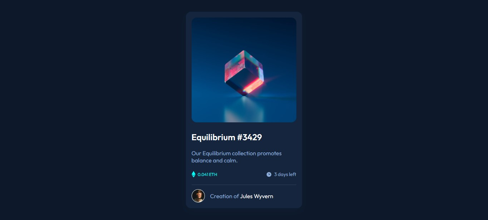

# Frontend Mentor - solução de componente de cartão de visualização NFT

Esta é uma solução para o [desafio do componente do cartão de visualização NFT no Frontend Mentor](https://www.frontendmentor.io/challenges/nft-preview-card-component-SbdUL_w0U). Os desafios do Frontend Mentor ajudam você a melhorar suas habilidades de codificação criando projetos realistas.

## Visão geral

### O desafio

Os usuários devem ser capazes de:

- Veja o layout ideal dependendo do tamanho da tela do dispositivo
- Veja os estados de foco e foco para elementos interativos

## Meu processo

### Construído com

- Marcação HTML5 semântico
- Propriedades personalizadas CSS
- Flexbox
- CSS Grid
- Fluxo de trabalho First-Mobile

## Autor

- Website - [engnei](https://www.engnei.com.br)
- Frontend Mentor - [@neirander](https://www.frontendmentor.io/profile/neirander)
- Linkedin - [@engney](https://www.linkedin.com/in/engney/)
